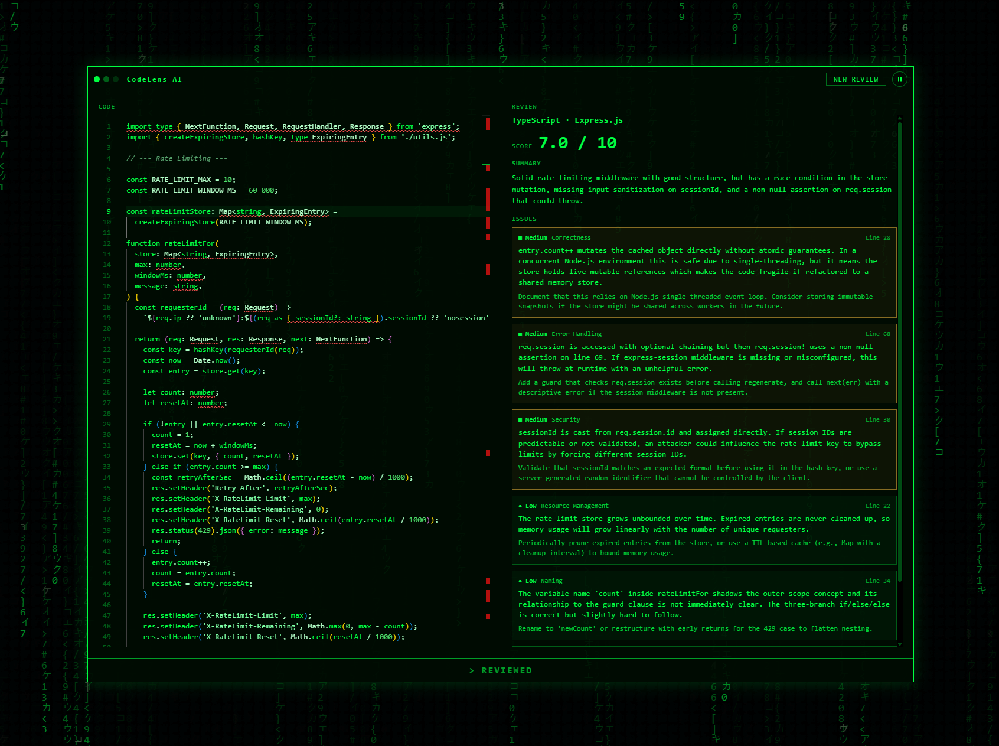

# CodeLens AI

AI-powered code review assistant. Paste code, get a structured review with severity-ranked issues and actionable suggestions. Matrix-themed interface.

Currently supports single-file analysis for any programming language.

## Run locally

Requirements: Node.js 20+ and pnpm.

```bash
pnpm install
pnpm dev
```

- Client: http://localhost:4000
- Server: http://localhost:4001

## Scripts

| Command             | Description                           |
| ------------------- | ------------------------------------- |
| `pnpm dev`          | Run client and server in watch mode   |
| `pnpm build`        | Build client and server for production|
| `pnpm start`        | Start the compiled server             |
| `pnpm lint`         | Lint with Oxlint                      |
| `pnpm typecheck`    | Type-check both workspaces            |

## Roadmap

- Multi-file analysis
- Code explanation
- Code fixing
- User authentication


## Screenshot
- 

